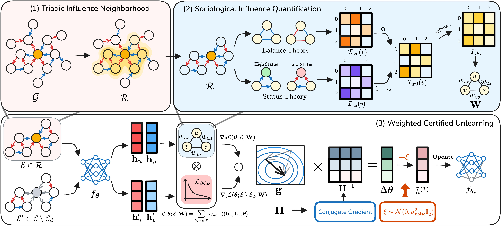

# Certified Signed Graph Unlearning

## Abstract
Data protection has become increasingly stringent, and the reliance on personal behavioral data for model training introduces substantial privacy risks, rendering the ability to selectively remove information from models a fundamental requirement. This issue is particularly challenging in signed graphs, which incorporate both positive and negative edges to model privacy information, with applications in social networks, recommendation systems, and financial analysis. While graph unlearning seeks to remove the influence of specific data from Graph Neural Networks (GNNs), existing methods are designed for conventional GNNs and fail to capture the heterogeneous properties of signed graphs. Direct application to Signed Graph Neural Networks (SGNNs) leads to the neglect of negative edges, which undermines the semantics of signed structures. To address this gap, we introduce \textbf{Certified Signed Graph Unlearning} (CSGU), a method that provides provable privacy guarantees while preserving the sociological principles underlying SGNNs. CSGU consists of three stages: (1) efficiently identifying minimally affected neighborhoods through triangular structures, (2) quantifying node importance for optimal privacy budget allocation by leveraging the sociological theories of SGNNs, and (3) performing importance-weighted parameter updates to enable certified modifications with minimal utility loss. Extensive experiments show that CSGU outperforms existing methods and achieves more reliable unlearning effects on SGNNs, which demonstrates the effectiveness of integrating privacy guarantees with signed graph semantic preservation.



## Experients

```bash
conda create -n CSGU python=3.10
conda activate CSGU
pip install -r requirements.txt
```

## Signed Graphs

```bash
python main.py --model SGCN --dataset bitcoin_alpha --unlearning_method CSGU
```

## Unsiged Graphs
The extended directory contains extended experiments for unsigned graphs.

```bash
cd extended
python main.py --model SGCN --dataset Cora --unlearning_method CSGU
```
