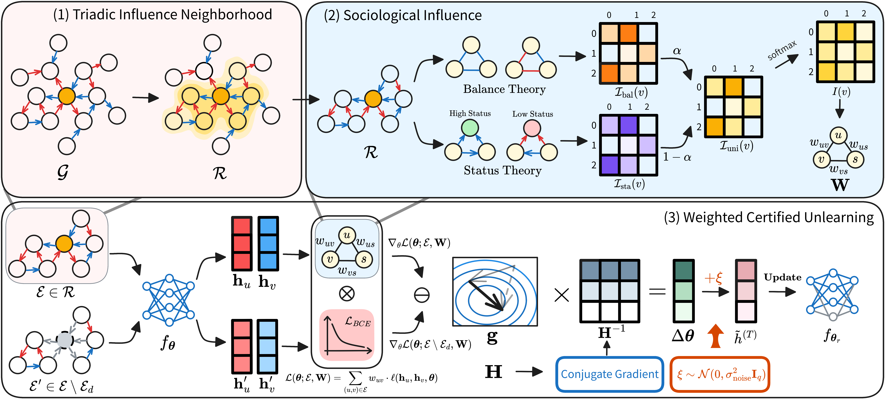

# Certified Signed Graph Unlearning

## Abstract
Signed graphs capture heterogeneous patterns through positive and negative edges, finding widespread real-world applications. Given the sensitive nature of such data, selective removal mechanisms have become essential for privacy protection. As a solution, graph unlearning enables the removal of specific data influences from trained Graph Neural Networks (GNN) without requiring full retraining. However, existing methods fail to account for the heterogeneous nature of signed graphs, thereby degrading both model utility and unlearning effectiveness. To address these challenges, we propose \underline{\textbf{C}}ertified \underline{\textbf{S}}igned \underline{\textbf{G}}raph \underline{\textbf{U}}nlearning (CSGU), which leverages the sociological principles underlying signed graphs, providing provable privacy guarantees while maintaining model utility. Specifically, CSGU efficiently identifies minimal influenced neighborhoods via triangular structures, and then applies sociological theories to quantify node influence. Subsequently, it performs influence-weighted parameter updates with calibrated noise injection to achieve certified privacy guarantees with minimal utility degradation. Extensive experiments across five datasets show that CSGU consistently outperforms four competing graph unlearning methods on four GNN architectures, achieving state-of-the-art results in both utility preservation and unlearning effectiveness.



## Experients

```bash
conda create -n CSGU python=3.10
conda activate CSGU
pip install -r requirements.txt
```

## Signed Graphs

```bash
python main.py --model SGCN --dataset bitcoin_alpha --unlearning_method CSGU
```

## Unsiged Graphs
The extended directory contains extended experiments for unsigned graphs.

```bash
cd extended
python main.py --model SGCN --dataset Cora --unlearning_method CSGU
```
